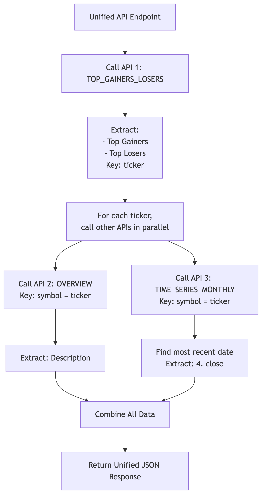
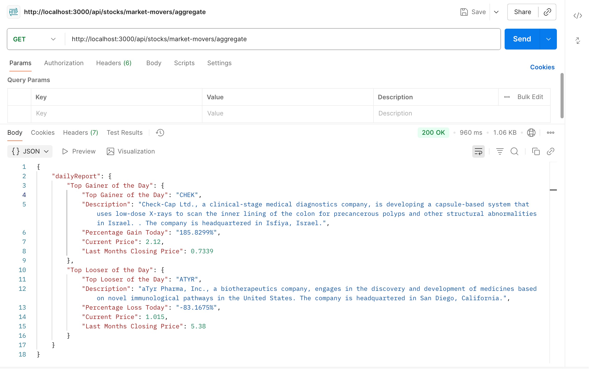
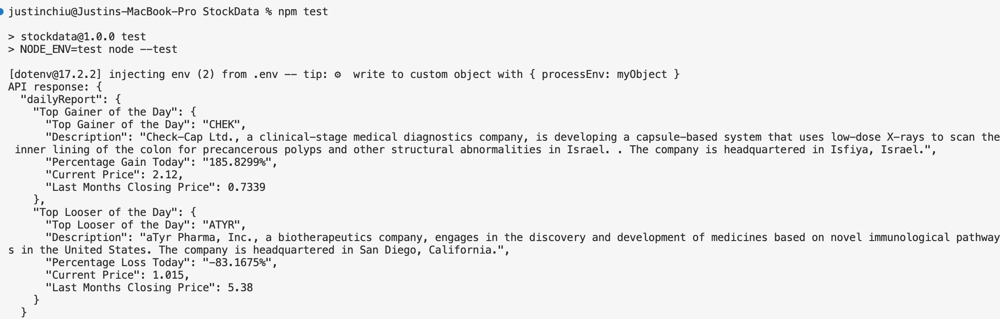

# Stockmarket at a Glance- highs and lows 

[](https://nodejs.org/)

> The purpose is to show the stock with the highest gain and the stock with the biggest loss of the day, and provide their company information and historical data.

> A Node.js + Express backend that aggregates **Top Gainer / Top Loser**, **company Description**, and **Last Month’s Closing Price** from Alpha Vantage.  
> This is a small assignment-style project focusing on API integration and JSON response aggregation. No database is used.


---

## Table of Contents
- [Features](#features)
- [Requirement documents](#requirement-documents)
  - [External APIs](#external-apis)
  - [Requirements](#requirements)
- [API Endpoints](#api-endpoints)
- [Installation](#installation)
- [Usage](#usage)
- [Sample Responses](#sample-responses)
- [Project Structure](#project-structure)
- [Notes](#notes)
- [Contact](#contact)

---

## Features
- Aggregates **three** [Alpha Vantage APIs](https://www.alphavantage.co/documentation/) into one response.
- Returns **Top Gainer of the Day** and **Top Loser of the Day** with:
  - `ticker` (as join key)（from TIME_SERIES_DAILY）
  - `percentageToday` / `currentPrice`  (from TIME_SERIES_DAILY）
  - `Description` (from OVERVIEW)
  - `Last Month Closing Price` (from TIME_SERIES_MONTHLY)
- Lightweight Node.js + Express. **No DB**, secrets via .env.

---

# Requirement documents

## External APIs

All API requests are made using **GET** method.

| API Function         | Endpoint Example                                                                                       | Purpose                                                                 |
|----------------------|---------------------------------------------------------------------------------------------------------|-------------------------------------------------------------------------|
| TOP_GAINERS_LOSERS   | `https://www.alphavantage.co/query?function=TOP_GAINERS_LOSERS&apikey=YOUR_KEY`                        | Sort results by change_percentage → get **Top Gainer** and **Top Loser of the Day**. <br>From the result: `ticker` → **Top Gainer/Loser of the Day**,<br>`price` → **Current Price**, <br>`change_percentage` → **Percentage Gain/Loss Today**. |
| TIME_SERIES_MONTHLY  | `https://www.alphavantage.co/query?function=TIME_SERIES_MONTHLY&symbol=IBM&apikey=YOUR_KEY`            | The `4. close` field in the Monthly Time Series data → **Last Month Closing Price**.                       |
| OVERVIEW             | `https://www.alphavantage.co/query?function=OVERVIEW&symbol=IBM&apikey=YOUR_KEY`                       | `Description` → **Description**.                                     |


## Requirements
1. **Get Top (Gainer/Loser)**
   - Call **TOP_GAINERS_LOSERS**.
   - Sort by `change_percentage`.
   - Extract:
     - **Top Gainer of the Day**
     - **Top Loser of the Day**
   - Keep `ticker` as the foreign key for later steps.

2. **Get Last Month’s Closing Price**
   - Use `ticker` from Step 1.
   - Call **TIME_SERIES_MONTHLY**.
   - Map `ticker` → `Symbol`.
   - From `"Monthly Time Series"`, take the  `4. close` field → Last Month Closing Price.

3. **Get Company Description**
   - Use the same `ticker` from Step 1.
   - Call **`OVERVIEW`**.
   - Map `ticker` → `Symbol`.
   - Extract the `Description` field.


## Data Processing Logic

<p align="center">
  
</p>


---

## API Endpoints


### Aggregated result (three APIs combined)

| Method | Endpoint                                     | Description                                                                                                           |
|--------|-----------------------------------------------|-----------------------------------------------------------------------------------------------------------------------|
| GET    | `/api/stocks/market-movers/aggregate`         | Returns **Top Gainer** and **Top Loser** with `ticker`, `percentageToday`, `currentPrice`, `Description`, `Last Month Closing Price` (with safe fallbacks). |

#### Example Response
```json
{
  "dailyReport": {
    "Top Gainer of the Day": {
      "Ticker": "IBM",
      "Description": "International Business Machines Corporation (IBM) is an American multinational technology company...",
      "Percentage Gain Today": "5.3%",
      "Current Price": "253.44",
      "Last Months Closing Price": "243.49"
    },
    "Top Loser of the Day": {
      "Ticker": "IBM",
      "Description": "International Business Machines Corporation (IBM) is an American multinational technology company...",
      "Percentage Loss Today": "-3.1%",
      "Current Price": "253.44",
      "Last Months Closing Price": "243.49"
    }
  }
}
```


**Fallback messages used when data is missing:**
- Description → `"Please check description in the official website"`
- Last Month Close → `"Please check Last Months Closing Price in the official website"`

---

## Installation
```bash
git clone https://github.com/yourname/StockData.git
cd StockData
npm install
Create .env in the project root:
PORT=3000
ALPHA_VANTAGE_KEY=your-alpha-vantage-key
```


## Usage

1. Create a .env file in the root directory and configure the environment variables:
    ```bash
    PORT=3000
    JWT_SECRET=your-jwt-secret
    ```

2. Start the server:
    ``` bash
    npm start
    ```
    The server will run on http://localhost:3000.

3. For development, you can use:
    ```bash
    npm run dev
    ```

## How to Test

You can test the API in two ways:

### 1. Using Postman
- Example Postman screenshot:

<p align="center">

</p>

### 2. Using Unit Tests
- Run the test suite from the command line:
```bash
npm test
```
<p align="center">

</p>


## Contact
If you have any questions or feedback, feel free to contact me:


> Email: cherryliuliuchen@gmail.com